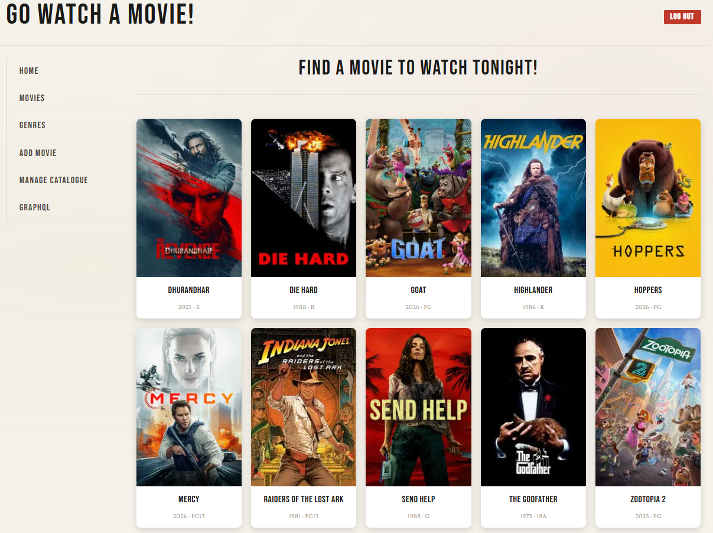

# Full-Stack Web Application: A Single-Page Application (SPA) application with React JS ang Go

- Developed a full-stack web application while completing Trevor Sawler’s “Working with React and Go” course on Udemy. [Link to the course](https://www.udemy.com/course/working-with-react-and-go-golang)
- Implemented frontend components in React and backend API endpoints in Go
- Worked with JSON APIs, routing, state management, and database integration
- Strengthened understanding of client-server architecture and full-stack application workflows

✅ Tech
- React JS
- REST API
- GraphQL
- Go (Golang)
- PostgreSQL

✅ [Link to the site](https://spa-react-go.vercel.app/)

